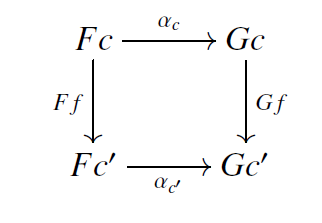

### natural transformation (Reihl)
- categories: C, D
- functors: $F, G: C \rightrightarrows D$
- natural transformation $\alpha_c : F(c)\rightarrow G(c) \in D$ for each object $c \in C$, the collection of which defines the components of the natural transformation such that for an for any morphism $f:c\rightarrow c^{\prime}$ the diagram commutes,

 meaning it has a common composite $F(c) \rightarrow G(c^{\prime})$ in D (the diagonal in this diagram)
"boundary data" needed to define the natural transform $\alpha$as